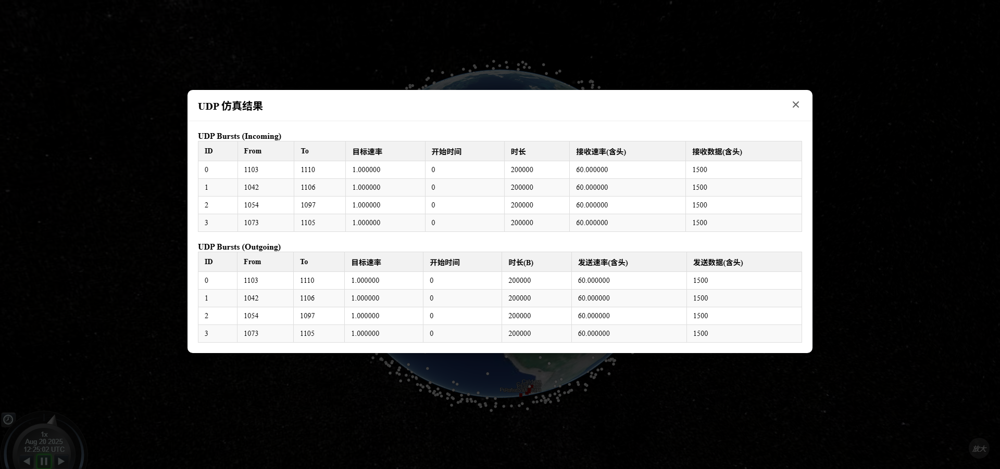

# `2025-08-20` 汇报
---

## 系统开发进展
1. 系统整体开发环境已成功迁移至 `Docker` 容器化方案，方便后续开发及部署：

2. 网络层仿真（`TCP`、`UDP`仿真）已实现前后端开发与接口集成
- 前端操作界面：

- `TCP` 仿真结果查看（界面`UI`待优化）

- `UDP` 仿真结果查看（界面`UI`待优化）

---

## 近展及后续安排

- **龙涛**：  
解决系统数据预计算及缓存问题。

- **李雨**:  
建立了一个地面卫星和可见卫星的ofdm通信，但是在处理多普勒和误码率上还有改进的空间，然后找了一个解析starlink信号的论文打算用它的接收方式来做一下，打算按着开源代码移植到代码里。

- **卓阳、陈璐璐、孙陈园**：  
准备比赛材料。

- **陈璐璐**：  
优化前端页面。

- **陆王**：  
主要在忙着申请国外学校、在解决matlab资源池问题。
