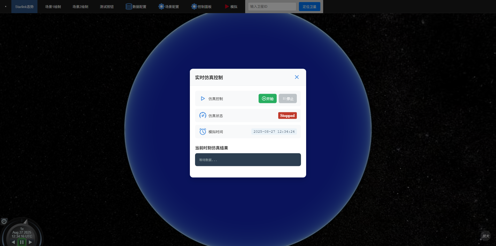

# `2025-08-27` 汇报

---

## 系统开发进展

1. 实现**分布式实时仿真预计算**（开发中，正在解决各种报错问题）
* **思路：**   

   - 采用 **生产者-消费者** 模式，将**前端数据生成**、**后端任务分发**与**后台并行计算**彻底解耦，为前端提供流畅的、基于**模拟时间**的实时数据显示。

* **各角色作用：**

  -  **Vue/Cesium (数据生产者 / 主时钟)**： 控制模拟时间的推进。批量计算未来一段时间的秒级位置坐标。

  -  **Spring Boot (总协调器)**：管理系统启停状态。接收前端的批量位置数据，并将其存入 Redis DB3 (位置队列)。 启动多线程池，并发地从 Redis DB3 消费位置数据，为每个时间点生成仿真任务，并发布到 Kafka (任务总线)。

  -  **Kafka (任务总线)**：作为任务队列， 接收来自 Spring Boot 的仿真任务，并持久化，等待 Django Worker 消费。

  - **Django + Celery (并行计算集群)**：
    - 部署为多个并行 Worker 实例。
    - **Kafka Consumer** 进程监听 Kafka，接收任务后派发给 Celery。
    - **Celery Workers** 并发执行耗时的NS3仿真。
    - 仿真完成后，将带时间戳的结果写入 Redis DB4 (结果缓存)。

*  **Redis (高速数据中心)**
    - `DB3 (List)`: **位置数据队列**，作为 Spring Boot 的任务源。
    - `DB4 (String)`: **仿真结果缓存**，供前端快速读取，TTL自动过期。
    - `DB5 (List)`: **Celery Broker**，管理 Celery 内部的任务调度。

2. 部分进展：前端控制页面（开发中）

---

## 近展及后续安排
- **龙涛**：  
继续实现**分布式实时仿真预计算**。

- **李雨**:  
本周大概看了一下论文和对应的代码，代码是一个starlink下行信号的生成和同步的代码，但是有一些报错，还在修改和理解代码

- **陈璐璐**：  
优化前端页面。

- **陆王**：  
在解决matlab资源池问题。

- **卓阳**：  
准备保研相关材料。
---