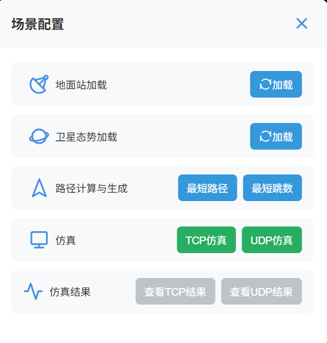

# `2025-09-10` 汇报

---

## 系统开发进展

1. 实现**分布式实时仿真预计算**（正在开发中）
- 目前已解决Redis存储数据、读取数据的相关问题（新引入ZSET）：
  * 已经实现不同时刻卫星、地面站数据存储Redis。
  * 已经实现`springboot`后端 异步读取Redis中的卫星地面站数据。
  * 已经实现异步、并行生成`TCP`仿真文件,并在本地完成存储（不同时刻）。

2. 前端界面的优化同步进行
   前端界面可优化的点比较少，目前暂定前端界面优化部分的工作暂时搁置。

---

## 近展及后续安排

- **龙涛**：  
  * 继续实现**分布式实时仿真预计算**。
  * 目前用于仿真的文件存储的地方是在后端，打算引入**MinIO**（一个开源、可私有化部署的S3兼容对象存储）。
  * 引入`MinIO`后下周尽可能解决Django任务调度问题。

- **庞孝森**：
  了解物理层的相关内容  

---