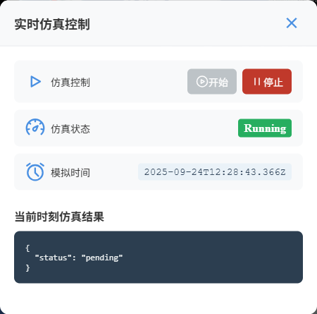
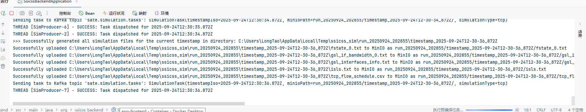
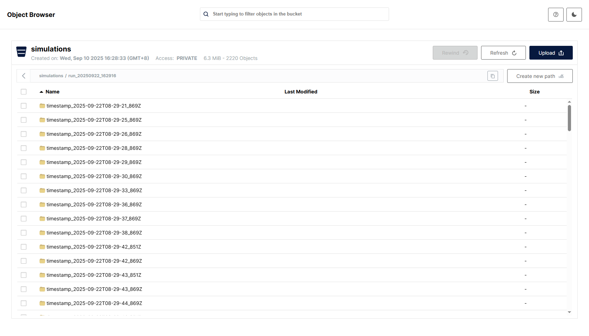
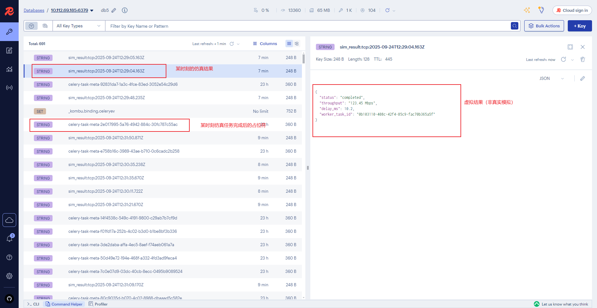
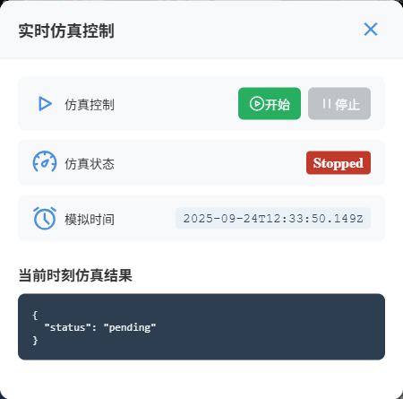
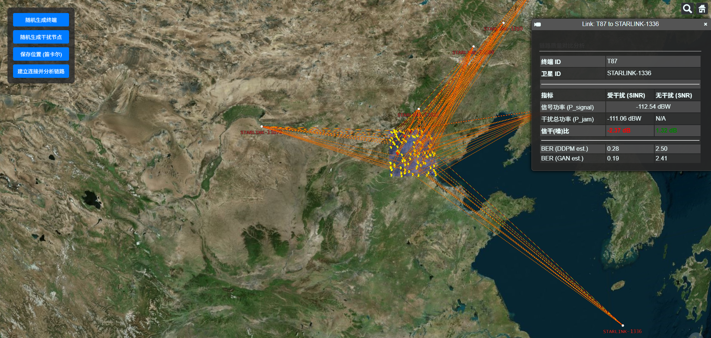

# `2025-09-24` 汇报

---

## 系统开发进展

1. **分布式实时仿真预计算**（基本开发完成，完整的流程已经可以跑通）
   以下是简单介绍（全面完成后会有更详细的介绍）：
- **设计目标：**
  在前端的用户时钟到达某个未来时间点 T 之前，后端分布式系统已经提前、并行地完成了该时刻 T 的仿真计算，并将结果缓存在高速数据库中，供前端按需、瞬时获取。

- **任务分解：**
  仿真的计算任务拆解为三个独立协作、并行运作的流水线：数据供应、异步计算和结果消费。

2. **系统运行的各个阶段简单介绍**
   1. **前端控制预计算任务的开始**
   
   2. **后端（Springboot）接收卫星、终端数据存入Redis，并行从Redis中读取数据生成仿真所需的文件，上传到MinIO中转站**
   
   3. **MinIo 中转站存储不同时间戳的用于仿真的文件**
   
   4. **Springboot后端上传文件后，同时向Django后端发送指令，触发动作（从MinIO读取文件并行进行仿真），仿真完成后将结果写入到Redis**
   
   5. **前端可以便捷的控制整个流程的开、关**
   

---

## 专利进展

### 专利名：**一种基于遗传算法的多卫星环境下通信干扰效能最大化部署策略**
1. **已经完成仿真场景的搭建**

2. 已经完成干扰指标初步计算（SINR、BER）

---

## 近展及后续安排

- **龙涛**：  
  * 继续实现**分布式实时仿真预计算**，将存入redis中的模拟数据替换成真实的模拟数据。
  * 完成后续全部流程的调试。
  * 专利方面，初步计算的干扰指标还有些问题，后面再修改修改。

- **庞孝森**：
  了解物理层的相关内容  

---