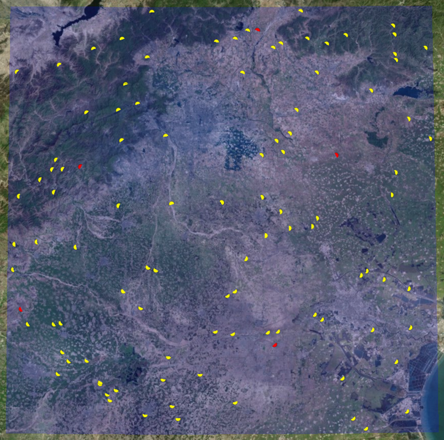
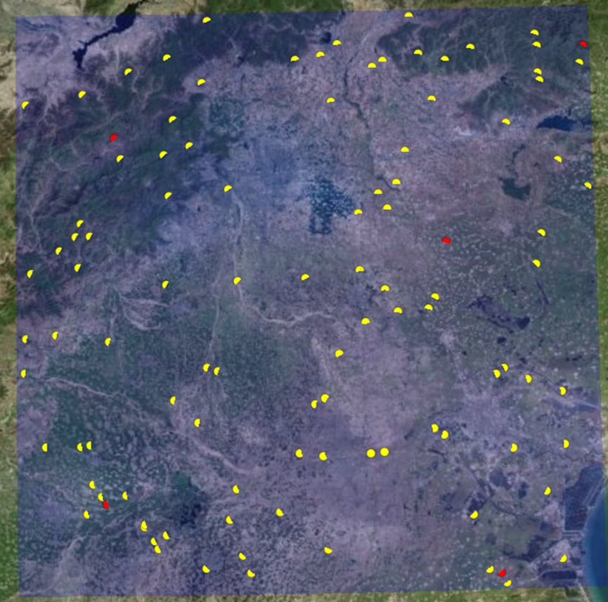

# `2025-10-17` 汇报

---

## 系统开发进展

1. **分布式实时仿真预计算**（基本开发完成，完整的流程已经可以跑通）
  * 正在实现将存入redis中的模拟数据替换成仿真生成的真实数据。这部分实现需要修改网络层的源码，目前还没完全实现。

---

## 专利进展

1. **专利方面**
   * 本周初已经完成专利文档内容的撰写。
   * 算法最终仿真效果有点不太满意（例如，图二中，干扰节点分布有点边缘化，直觉上我感觉最优的干扰节点分布应该不会分布的那么边缘），所以目前在不停的调整参数，有点浪费时间（每次运行需要`4-6`个小时）。
   * 图一 ：初始的干扰节点分布（随机分布）

   * 图二：某一次运行输出的最优方案
  
---

## 近展及后续安排

- **龙涛**：  
  * 继续实现**分布式实时仿真预计算**，完成后续全部流程的调试。
  * 专利方面，再跑2、3天的仿真，看看能不能找到一个直觉上更好的仿真结果（干扰节点的分布不那么边缘）。

- **庞孝森**：
  - 看论文
  - 学习`matlab`中

---